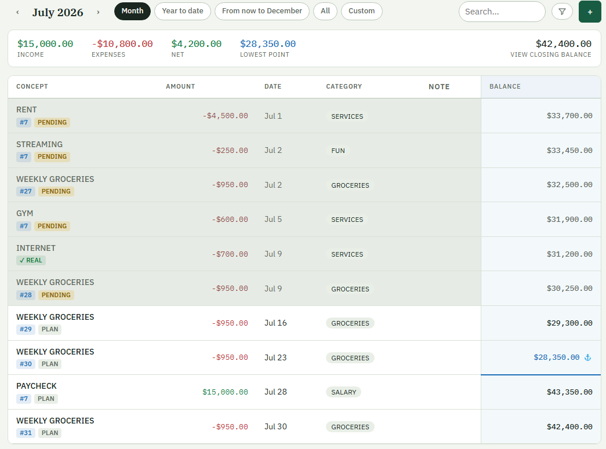
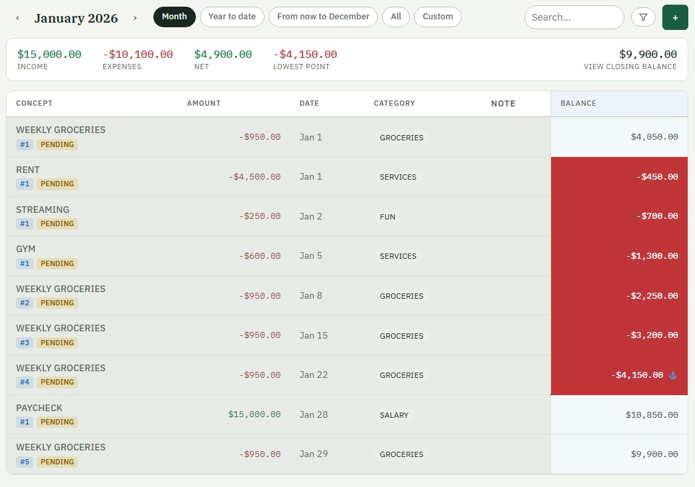
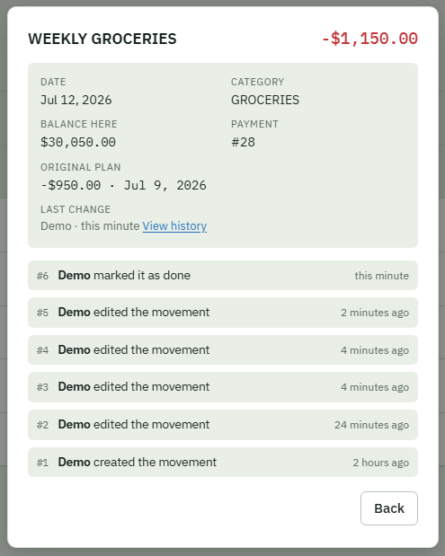
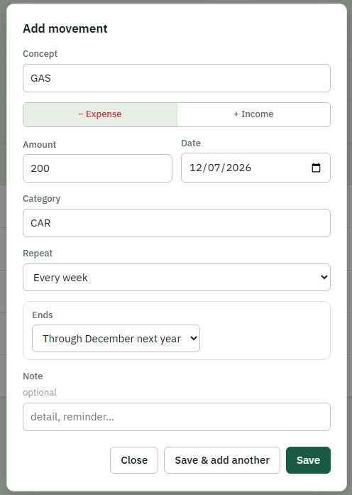
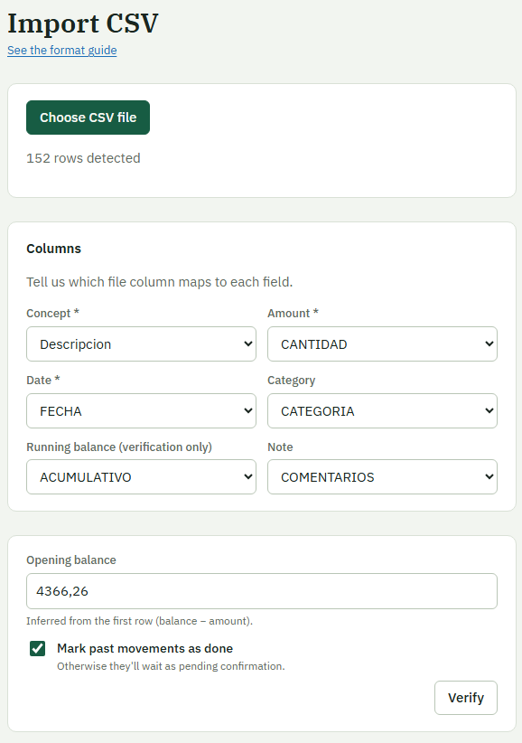
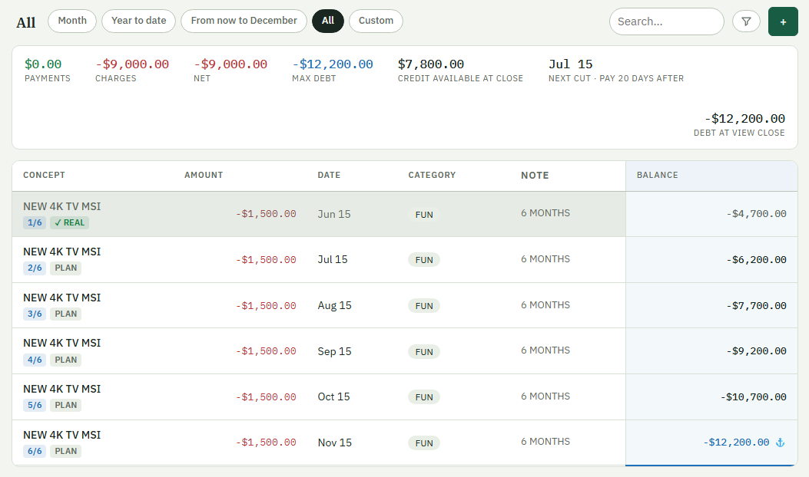
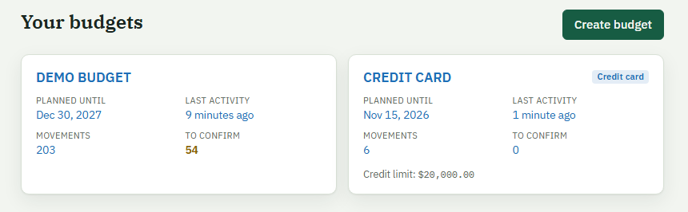
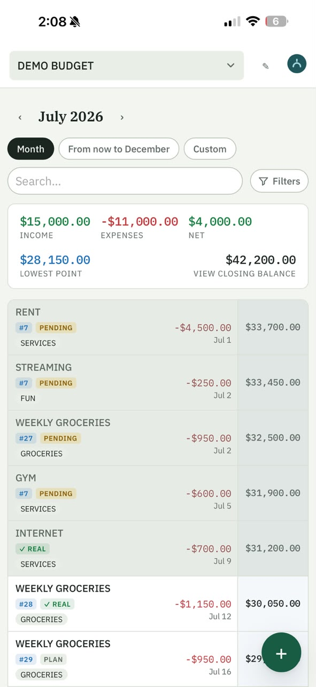
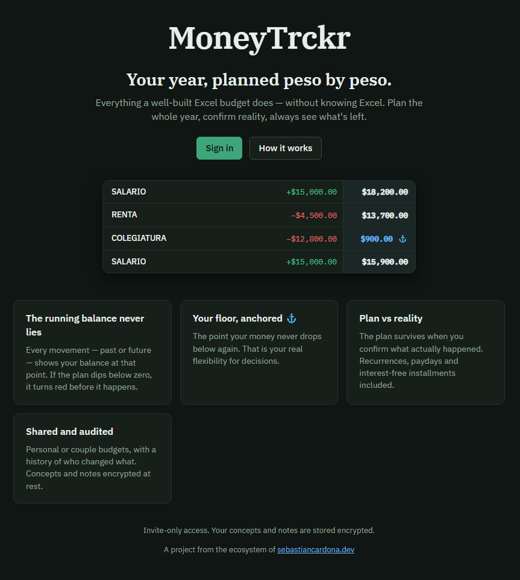
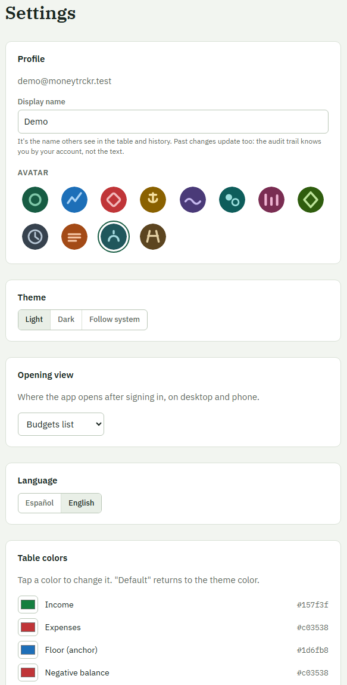

# MoneyTrckr — Case Study

> A production personal-finance planner that replaces a battle-tested Excel budget —
> built, tested and shipped to a self-hosted VPS in **three days**, as the flagship of
> the [sebastiancardona.dev](https://sebastiancardona.dev) ecosystem.
>
> **Live:** https://moneytrckr.sebastiancardona.dev (invite-only) · **Source:** private
> (this document, the architecture and the screenshots are the public artifact)

## 1. The problem — and why "another budget app" is the wrong frame

For years my household finances ran on one Excel sheet: every income and expense of the
**entire year**, planned in January, with a running accumulated balance recalculated on
every row. Two pieces of conditional formatting made it irreplaceable:

- **The red line** — any row where the projected balance goes below zero. That is not
  information, it's an alarm: the plan must be reshaped until nothing is red.
- **The floor marker** — the row whose balance is never undercut again. That number is
  the household's *real* flexibility: money you never need from that point forward.

No budget app I found models *forward-planned* yearly finance with those two semantics.
And the sheet's real limitation was never features — it was that **only the person who
built it can operate it safely**. One wrong drag of a formula and the year is corrupted.
The product goal: everything the sheet does, operable by someone who has never opened
Excel — starting with my wife, then a small invite-only circle.

## 2. Value proposition

- **Plan a whole year forward**, not track a month backward. Recurrences (monthly
  day-N with month-end clamping, weekly, biweekly, yearly) and Mexican-style
  interest-free installments (MSI) generate the year in seconds.
- **The balance never lies**: the accumulated column is computed server-side over the
  *whole* ledger — filters change what you see, never the math. Red = the plan doesn't
  survive. ⚓ = your floor.
- **Plan vs reality as a first-class concept**: planned rows are *actualized* with the
  real amount/date; the plan survives for comparison. Pending rows wait, flagged.
- **Trust, engineered**: invite-only registration, shared budgets with roles
  (owner/editor/viewer), an append-only audit trail of who changed every row, and
  at-rest encryption of personal text so even a database dump reads nothing.
- **Migration is a feature**: the CSV importer replays your sheet through the real
  projection engine and diffs every computed balance against the sheet's own
  accumulated column *before* writing anything.

## 3. Architecture

```
Browser / iPhone PWA (React 19 + TS, es/en, installable)
        │ HTTPS
Cloudflare (proxied DNS: unmetered egress, hidden origin, DDoS shield)
        │
Traefik v3 (VPS)
  ├─ /api without X-Edge-Key ──► 403 at the proxy (never reaches the JVM)
  ├─ rate limit (15 r/s, burst 40)
  └─ one container: Spring Boot 3 / Java 21
        ├─ serves the built SPA from the jar (single image = single pipeline slot)
        ├─ REST API: JWT (argon2id, rotating refresh cookie), invite-gated register
        ├─ projection engine (pure JVM, the heart — see §4)
        ├─ append-only audit (every mutation snapshotted, snapshots encrypted)
        ├─ AES-256-GCM at-rest encryption of descriptions/notes
        └─ PostgreSQL 16 (own container, internal network, Flyway migrations)

CI/CD: GitHub Actions → GHCR → build-once-promote pipeline
  every push → test env (seeded with pure dummy data, basic-auth'd)
  every tag  → gated through test → GitHub Release → prod (health gate + auto-rollback)
```

## 4. Signature engineering

**The projection engine.** Deterministic, pure-JVM, fully unit-tested: canonical
ordering (date asc, then amount desc so incomes precede expenses — the sheet's own
rule), accumulated series from the opening balance, and three flag computations
(negative-threshold, suffix-minimum floors with tie semantics, past/overdue). Credit
cards reuse the identical engine with one parameter: the alarm threshold moves from 0
to −creditLimit.

**Proof over promises.** The engine's acceptance test replays the *real* 292-row
family sheet and asserts every single accumulated value matches Excel's output to the
cent. The CSV importer gives users that same guarantee interactively: dry-run first,
per-row diff report, all-or-nothing commit.

**One image, zero pipeline changes.** The ecosystem's deploy pipeline assumes one
image per app. Instead of extending it, the Spring jar serves the compiled SPA from
its classpath — API, web and health contract in a single ~420 MB image, non-root,
health-checked, version-stamped via build args onto `/info`.

**Egress defense in depth.** A Hetzner VPS has a 40 TB egress budget an attacker could
burn. Layers: Cloudflare absorbs volume and hides the origin; a Traefik router rule
requires a static `X-Edge-Key` header on `/api/*` — requests without it die at the
proxy with 403 and **never touch the JVM**; a rate limit caps what passes; JWT guards
all data regardless. The key is served to the SPA at runtime (`/app-config.js`) so
rotation is an env edit, and its honest limit is documented: it filters automation,
not humans — real identity arrives with the ecosystem's own OIDC provider (next
project).

**Privacy engineering with honest boundaries.** Descriptions and notes (the personally
revealing text) are AES-256-GCM encrypted at rest — including inside audit snapshots —
with a key that lives only in the server environment. Amounts, dates and categories
stay computable (the engine needs them), and the operator of a running server could
still read data through the app; the case for client-side E2E is written down as the
successor design, not hand-waved away.

**Bilingual by architecture, not translation pass.** Every UI string lives in a typed
es/en dictionary; the account's locale decides (anything non-Spanish renders English),
`Intl` drives all money/date/relative-time formatting, and new-account language is
inherited from the browser at registration.

## 5. Trade-offs made on purpose

| Decision | Why |
|---|---|
| Server-side projection (not client) | One source of truth for money math; shared ledgers see identical numbers; enables the import cross-check. Cost: fields the engine reads can't be E2E-encrypted yet. |
| Single image (SPA inside the jar) | Pipeline untouched; atomic versioning of front+back. Cost: front-only changes rebuild the jar. |
| Static edge key instead of OAuth today | Days-not-weeks to production with real protection against scanners; the OIDC provider is its own portfolio project and replaces it cleanly. |
| No service worker in the PWA yet | Deliberate: no stale-cache risk during daily iteration with real users. Installability works; offline is backlog. |
| Full recompute per change (~2k rows/yr) | O(n) at this scale is microseconds; incremental recompute is documented as a scaling lever, not built speculatively. |

## 6. Results

- **~3 days** from empty repo to production URL, through a gated pipeline with
  auto-rollback — while shipping four rounds of real-user feedback along the way.
- **51 automated tests** (unit + Testcontainers integration over HTTP + Postgres),
  including the 292-row real-sheet replay and cross-tenant security denials.
- **v0.1.0 verified in production**: health-gated deploy, edge gate returning 403 to
  unverified `/api` from the public internet, Cloudflare proxying confirmed.
- Two real users migrating a real household budget; invite-only circle next.
- First private-repo integration exercised the platform: GHCR registry auth and
  Windows→Linux executable-bit bites found, fixed, and codified as pipeline standards.

## 7. Screenshots

*All captures use the seeded demo environment — never real family data.*

**The grid, current month.** The waterline balance column, status tags, and the
summary strip for the active view:



**The two signature semantics.** A January where rent lands before the paycheck:
the balance floods red exactly where the plan doesn't survive, and the ⚓ marks the
floor — money never needed again from that point:



**Plan vs reality + audit.** A row's sheet: the original plan preserved next to the
actualized values, and a named history of who changed what:



**Planning a year in one dialog.** Quick Add with the recurrence section open:



**Proof over promises, user-facing.** The importer maps columns (auto-guessed from
the sheet's headers), infers the opening balance from the first row, and dry-runs
everything through the real engine before a single row is written:



**Same engine, shifted threshold.** A credit card: installment chips (n/N), cut-day
awareness, and the alarm at −limit instead of 0:



**Multi-ledger home.** Metadata per budget: planned-until, last activity, and how
many movements await confirmation:



**Mobile.** The same megatable, redesigned as two-line rows with the balance as a
full-height waterline rail:



**Public face** (system-language with an EN/ES toggle; social metadata renders a
full card on WhatsApp/LinkedIn):




**Personalization.** Per-user themes, semantic color overrides with live pickers,
language, avatars:


