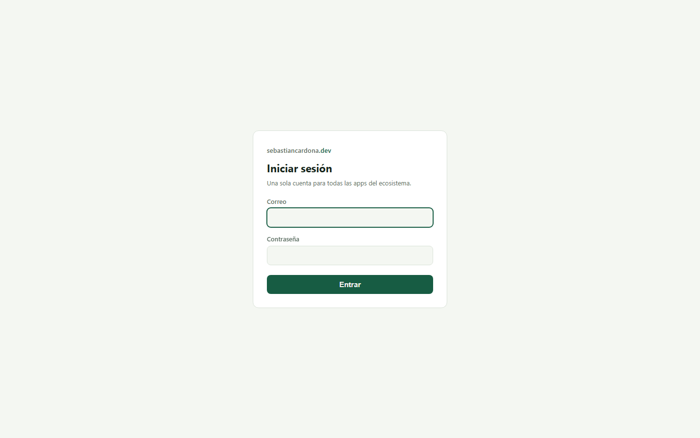
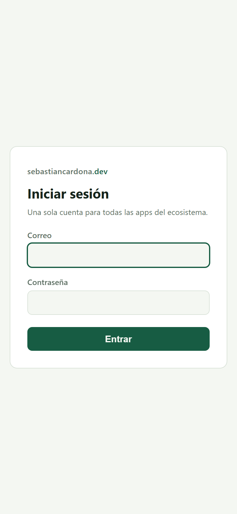

# Ecosystem SSO — Case Study

> One account for every app on [sebastiancardona.dev](https://sebastiancardona.dev): an
> OAuth2 / OIDC identity provider built on **Spring Authorization Server**, then proven
> the only way that counts — by swapping the identity provider **under a live production
> app** (MoneyTrckr, real users, real financial data) with **zero controller changes**.
>
> **Live:** https://auth.sebastiancardona.dev · **Source:**
> [github.com/sebastiancardona-dev/auth-service](https://github.com/sebastiancardona-dev/auth-service)
> · Companion: the [MoneyTrckr case study](../moneytrckr/CASE-STUDY.md)

## 1. The problem — and the advice this project takes seriously

By Phase 3 the ecosystem had three apps with more coming, each needing accounts.
Duplicating login, password storage and session policy per app is how real organizations
end up with five password databases; the fix is the one real organizations use: **one
identity provider, every app an OIDC client**.

"Never build your own auth" is correct advice — and this project respects the *reason*
behind it rather than the slogan. The danger in DIY auth is hand-rolled protocol flows
and crypto, so those are Spring Authorization Server's: the same RFC implementations
(6749, 7636, OIDC Core) that back commercial products. What I built is the policy shell
around it:

| Framework owns | This codebase owns |
|---|---|
| Authorization code + PKCE flow mechanics | Which flows are allowed at all (code + PKCE, nothing else) |
| Token signing/validation (Nimbus JOSE) | Key storage, rotation cadence, `kid` pinning |
| Client authentication | Client registration policy, secret lifecycle |
| OIDC discovery / userinfo / logout endpoints | Claims design (groups, per-app roles), invite gate, audit |

Alternatives were weighed, not skipped: Keycloak (near-zero code, but operating it
teaches ops, not protocol — and understanding the protocol was the goal) and fully
hand-rolled (maximum learning, irresponsible for anything internet-facing).

## 2. The provider

```
Browser ──HTTPS──► Cloudflare ──► Traefik v3 (VPS)
                                     │
                       auth.sebastiancardona.dev
                       Spring Boot 3 / Java 21 + Spring Authorization Server
                         ├─ authorization code + PKCE — required for EVERY client (RFC 9700)
                         ├─ 10-min access tokens · refresh rotation with reuse rejection
                         ├─ JWKS: DB-backed signing keys, 30-day rotation, active kid pinned
                         ├─ invite-gated registration (tokens stored as SHA-256, expiry + max-uses)
                         ├─ argon2id passwords · per-user+IP sliding-window rate limit
                         ├─ headless admin API (bearer-only chain — no cookies, no CSRF surface)
                         └─ append-only audit: logins, failures, invites, client registrations
                                     │
                       PostgreSQL 16 (isolated DB, Flyway migrations)
```

Design choices worth defending:

- **DB-backed signing keys.** The default (in-memory keys) means every redeploy rotates
  the JWKS and invalidates every outstanding token. Keys live in the isolated auth
  database instead: **signing keys survive redeploys** (verified in production), rotate
  on a 30-day schedule, and old keys stay published for verification until retired.
  The subtle bug: `NimbusJwtEncoder` refuses to choose among multiple matching keys, so
  the active `kid` is pinned in the JWS header via the token customizer.
- **PKCE for everyone.** Spring only *mandates* PKCE for public clients; this provider
  requires it for confidential clients too, per current best practice (RFC 9700).
- **No consent ceremony.** All clients are first-party, so consent is disabled per
  client — one less dark pattern. The flag is per-client, so a future third-party
  client flips it back on.
- **Bootstrap without a chicken-and-egg.** Registering a client needs an admin token;
  getting a token needs a client. The service seeds a first-party `admin-cli` public
  client (PKCE, RFC 8252 loopback redirect) and a terminal script runs the code flow —
  that one script is how every real client got registered.
- Accepted trade-offs, documented not hidden: no MFA in v1 (TOTP on the backlog);
  in-memory rate limiter resets on restart (single instance); keys as PEM in an
  isolated DB rather than an HSM — this runs on a €6.49/mo VPS, and the cost boundary
  is part of the design.

## 3. The migration — swapping the IdP under a live app

MoneyTrckr shipped months earlier with local JWT auth **deliberately isolated behind an
interface**, because this provider was already on the roadmap. The migration was the
payoff test: could the identity provider be swapped under a live production app without
touching its domain?

**Answer: yes. Zero controller changes.** Every endpoint kept its
`@AuthenticationPrincipal Jwt` contract; the swap lives in one filter, one converter
and one security config.

### Plan A died in five minutes — on purpose

Plan A was the textbook SPA setup: frontend holds the tokens, API validates them. A
five-minute probe against the live provider killed it: **Spring Authorization Server
issues no refresh tokens to public clients**, and without refresh tokens the PWA's
21-day persistent sessions die. Design decisions should lose to evidence this cheaply.

Plan B (shipped): **backend-for-frontend**. The Spring backend is the confidential
OIDC client (code + PKCE + secret); the browser holds only a session cookie
(SameSite=Lax + CSRF token); sessions live in Postgres via Spring Session so deploys
don't log anyone out. A token-relay filter re-establishes API authentication per
request from the session's auto-refreshed access token, and an identity mapper joins
ecosystem claims onto the local user everything foreign-keys to:

- **JIT provisioning** — first login creates the local row (name/locale from claims).
- **Email linking** — pre-SSO accounts adopt their ecosystem identity on first login;
  nobody lost their data.
- **Role mirroring** — ecosystem group `admin` maps to the app's root role, with a
  per-app claim override; central demotion propagates on the next request.
- The re-issued JWT carries the **local** user id as `sub` — which is exactly why no
  controller noticed the identity provider changed.

Deleted in the same stroke: local login/refresh/registration endpoints, token services,
password hashes, the in-app invite system (registration lives on the auth service now),
and the interim edge-key gate that had shielded the API since launch.

| Decision | Why |
|---|---|
| BFF over SPA-held tokens | Probe showed no refresh tokens for public clients; cookies + server-side sessions also shrink the XSS token-theft surface. Cost: the backend owns session state (Postgres via Spring Session). |
| PKCE required for confidential clients too | RFC 9700 posture at the provider; one resolver customizer on the client side. |
| DB-backed signing keys | Tokens and sessions survive redeploys; rotation is a scheduled job, not an outage. |
| RP-initiated logout only (v1) | Spring Authorization Server ships no back-channel logout; the honest ≤10-minute window is documented instead of glossed over. |

## 4. What only production could teach

Unit suites were green the whole time; the deployed test environment found four bugs:

1. **`redirect_uri` built as `http://`** — the app never needed to know it sat behind a
   TLS proxy until OIDC made the scheme part of the protocol
   (`server.forward-headers-strategy: framework`).
2. **No PKCE on the authorize request** — Spring only adds PKCE for public clients;
   this provider requires it for everyone. One resolver customizer.
3. **The CSRF cookie that never was** — Spring Security 6 defers token generation;
   without an explicit touch-filter the cookie never reached the browser and logout
   403'd.
4. **The saved-request hijack** — a background API fetch that 401'd before login became
   the post-login redirect target: the user landed on raw JSON. The request cache now
   excludes `/api/**`; page deep-links still survive the login round-trip.

Known caveat, documented not hidden: sharing a ledger by email requires the other
person to have opened the app once (JIT creates rows on first contact). Fine at
invite-wave scale; pre-provisioning via the auth admin API is on the backlog.

## 5. Single sign-out, honestly

The provider ships RP-initiated logout only (no back-channel in Spring Authorization
Server). Logging out of MoneyTrckr kills its session *and* the central one; other apps
drop off at their next access-token refresh, within 10 minutes. That window is stated
plainly in both case studies instead of glossed over — and a custom logout-token
notifier is the documented path if it ever matters.

## 6. Results

- **Full OIDC provider live** at auth.sebastiancardona.dev: discovery, JWKS with
  30-day DB-backed rotation (keys survive redeploys — verified), code + PKCE only,
  userinfo, RP-initiated logout, invite-gated registration, headless admin API,
  append-only audit of every security event.
- **A real production migration completed against it**: the ecosystem's flagship app
  authenticates through it exclusively, with zero controller changes; its interim
  edge-key gate is retired. The portal followed as the second OIDC client, hosting the
  admin UI over the headless API.
- **63 automated tests across the pair** (13 provider + 50 in the migrated app),
  including full-protocol integration drives with negative cases: PKCE-less authorize
  rejected, rotated-refresh reuse rejected, dead invites refused.
- **Verification before the tag**: a scripted end-to-end drive covering what a browser
  does — anonymous 401 → authorize redirect (PKCE) → login → code → BFF session →
  identity-linked user → pre-SSO data loads → RP-initiated logout → session dead —
  then the same flow by hand on desktop and iPhone PWA, before the release gated
  through test into prod with health-gate and auto-rollback watching.

## 7. Screenshots

**The login page every app shares.** One place to sign in for the whole ecosystem;
registration is invite-only, so there is no open sign-up to abuse:



**The same page on a phone** — the flow MoneyTrckr's iPhone PWA users go through:


